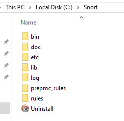

This is customised SnortIDS v2.9 to suit Microsoft Windows, follow the following steps to get it working:

1. It is better to install it in a fresh Windows 10 to avoid the possible **_0xc00000b_** error if you use Windows Sever (there is another installation guide for Windows server case).
   - This Windows 10 can be used as a Network or Host IDS and also as a security analyser (security analyser is discussed in a different guide), but a copy of the network traffic should be forwarded to it in case of Network IDS.
   - The following steps will use the Windows 10 as Host IDS, i.e, no need to forward any traffic to Windows 10.
1. Download and install [Npcap](https://npcap.com/dist/npcap-1.79.exe).

   - Npcap needed by SnortIDS for traffic capturing and it is part of Wireshark.
   - Although Npcap  will be installed with Wireshark, it is better not to install Wireshark before Npcap because this will trigger **_0xc00000b_** error. If you see the **_0xc00000b_** error because you installed Wireshark first, then just remove Wireshark and Npcap, restart the machine, install Npcap first.
   
1. Download SnortIDS from this [repository](https://github.com/kaledaljebur/snortids-windows/raw/main/Snort.zip) and unzip it in the C drive in Windows to be in
   - c:\Snort\ \
     
1. Run CMD as administrator and change directory to SnortIDS folder using:
   - cd c:\snort\bin \
     
1. Check the version of SnortIDS, just to make sure there are no errors
    - snort -V \
     
    - If you see **_0xc00000b_** error, then follow the suggestion in step 2 above.
1. Check the numbers of the available network adapters to select the one will be used by SnortIDS. 
   - snort -W
     
   - In my case, the number is 1 according to the above image, because 2 is for the loopback interface.

1. Run SnortIDS using:
   - snort -i 1 -c C:\Snort\etc\snort.conf -A console \
     
     
   - Notice:
     - The above image means SnortIDS is running fine and ready for detection.
     - -i for the interface number.
     - -c for SnortIDS configuration file.
     - -A Alerts will be listed in the console.
    - You can test the configuration file and rules without running SnortIDS using:
      - snort -i 1 -c C:\Snort\etc\snort.conf -T \
      
1. Test the detection of ICMP, just to make sure the topology is working as expected.

   - Ping continuously the SnortIDS machine from external machine. \
     
   - Then you should see the below in SnortIDS console even if the host firewall is blocking suck inbound requests: \
     

1. Test the detection of SYN port scanning, this represent a passive attack as requeued by the assignment, ask your teacher if you have any questions.
   - Download and install [Zenmap](https://nmap.org/dist/nmap-7.95-setup.exe) in the Windows machine used for Ping before, then run it with the following options: \
      \
     Notice the 192.168.8.160 is the IP of SnortIDS machine.
   - Then you should see the below in SnortIDS console. \
     
1. Download and install Wireshark, then analyse the log files:
   - Logs can be located in: \
     
   - Logs can be examined by Wireshark: \
     
1. The two tested rules in SnortIDS can be locate here: \
    - c:\Snort\rules\local.rules \
       \
      First rule at line 22 is for general ICMP ping detection if a quick topology test is needed. \
      The second at line 25 is for detecting SYN port scanning. \
      You can add # at the start of the line to disable any of them. \
      SnortIDS will need to be restarted for any changes. \

1. Restarting SnortIDS can be by stopping the current running command using CRTL+C in the keyboard then run the SnordIDS command again (in step 7 above).
1. Check the SnortIDS [manual](http://manual-snort-org.s3-website-us-east-1.amazonaws.com/) for more details.